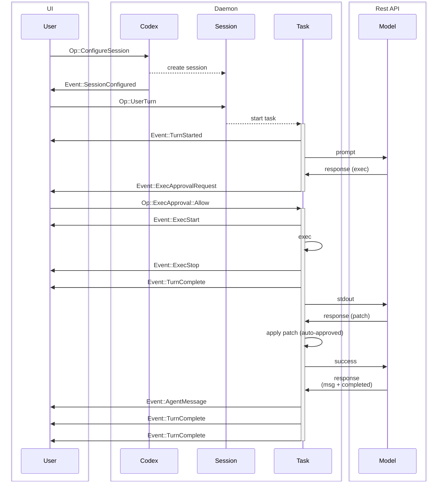
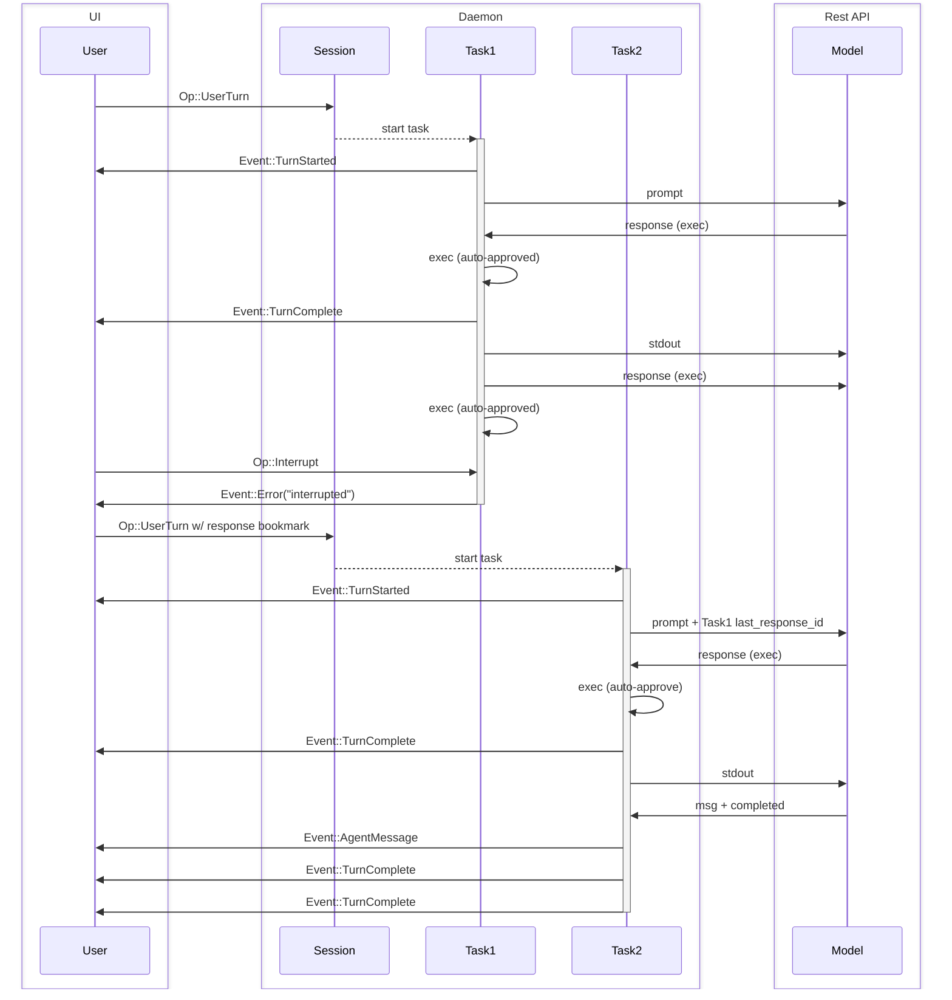

Visão geral do protocolo definido em [protocol.rs](../protocol/src/protocol.rs) e [agent.rs](../core/src/agent.rs).

O objetivo deste documento é definir a terminologia utilizada no sistema e explicar o comportamento esperado do sistema.

NOTA: O código pode não corresponder totalmente a esta especificação. Há algumas pequenas alterações que precisam ser feitas após a revisão desta especificação, as quais não alterarão a funcionalidade da TUI existente.

## Entidades

Essas são entidades existentes no backend do Codex. O objetivo desta seção é definir o vocabulário e construir um modelo mental compartilhado para o sistema central `Codex`.

0. `Model`
   - No nosso caso, trata-se da API REST de respostas
1. `Codex`
   - O mecanismo central do Codex
   - É executado localmente, seja em uma thread em segundo plano ou em um processo separado
   - Comunicado por meio de um par de filas – SQ (Fila de Envio) / EQ (Fila de Eventos)
   - Recebe entradas do usuário, envia solicitações ao `Model`, executa comandos e aplica patches.
2. `Session`
   - A configuração e o estado atuais do `Codex`
   - `Codex` começa sem `Session` e é inicializado por `Op::ConfigureSession`, que deve ser a primeira mensagem enviada pela interface do usuário.
   - O `Session` atual pode ser reconfigurado com chamadas `Op::ConfigureSession` adicionais.
   - Qualquer execução em andamento é interrompida quando a sessão é reconfigurada.
3. `Task`
   - Um `Task` é um `Codex` que executa uma tarefa em resposta à entrada do usuário.
   - O `Session` tem, no máximo, um `Task` em execução por vez.
   - Ao receber `Op::UserTurn`, inicia-se um `Task` (`Op::UserInput` é obsoleto)
   - Consiste em uma série de `Turn`s
   - O `Task` é executado até que:
     - O `Model` conclui a tarefa e não há saída para alimentar um `Turn` adicional
     - Uma entrada adicional do usuário interrompe a tarefa atual e inicia uma nova
     - A interface do usuário é interrompida com `Op::Interrupt`
     - Ocorreram erros fatais, por exemplo: `Model` conexão que excedeu os limites de tentativas
     - Bloqueado pela aprovação do usuário (execução de um comando ou patch)
4. `Turn`
   - Um ciclo de iteração em um `Task` consiste em:
     - Uma solicitação para o `Model` - (inicialmente) prompt + (opcional) `last_response_id`, ou (em loop) a saída do turno anterior
     - O `Model` retorna as respostas em um SSE, que são coletadas até que seja recebida a mensagem “concluído” e o SSE seja encerrado
     - `Codex` em seguida, executa o(s) comando(s), aplica o(s) patch(es) e exibe a(s) mensagem(ns) retornada(s) pelo `Model`
     - Faz uma pausa para solicitar aprovação quando necessário
   - A saída de um `Turn` é a entrada para o próximo `Turn`
   - Um `Turn` que não gera saída encerra o `Task`

O termo “UI” é usado para se referir ao aplicativo que controla o `Codex`. Pode ser a interface do tipo chat da CLI/TUI que os usuários utilizam, ou uma interface gráfica (GUI), como uma extensão do VSCode. A UI é externa ao `Codex`, já que o `Codex` foi projetado para ser operado por implementações arbitrárias de UI.

Quando um `Turn` é concluído, o `response_id` da mensagem final `response.completed` do `Model` é armazenado no estado `Session` para retomar a thread na próxima vez que for a vez do usuário. O `response_id` também é retornado no `EventMsg::TurnComplete` para a interface do usuário, podendo ser usado para bifurcar a thread a partir de um ponto anterior, fornecendo-o em uma próxima vez do usuário.

Como apenas 1 `Task` pode ser executado por vez, para tarefas paralelas, recomenda-se que um único `Codex` seja executado para cada thread de trabalho.

## Interface

- `Codex`
  - Se comunica com a interface do usuário por meio de `SQ` (Fila de envio) e `EQ` (Fila de eventos).
- `Submission`
  - Estas são as mensagens enviadas no `SQ` (IU -> `Codex`)
  - Possui um ID de string fornecido pela interface do usuário, conhecido como `sub_id`
  - `Op` refere-se à enumeração de todas as cargas úteis possíveis `Submission`
  - Na base de código atual, trata-se principalmente de tipos Rust em processo, e não de um contrato de transmissão serde estável
    - Esta enumeração é `non_exhaustive`; variantes poderão ser adicionadas no futuro
- `Event`
  - Estas são mensagens enviadas no `EQ` (`Codex` -> interface do usuário)
  - Cada `Event` possui um ID não exclusivo, que corresponde ao `sub_id` da operação de turno do usuário que iniciou a tarefa atual.
  - `EventMsg` refere-se à enumeração de todas as cargas úteis possíveis `Event`
    - Esta enumeração é `non_exhaustive`; variantes poderão ser adicionadas no futuro
    - É de se esperar que, com o tempo, novas variantes `EventMsg` sejam adicionadas para fornecer informações mais detalhadas sobre as ações do modelo.

Para obter a documentação completa das variantes `Op` e `EventMsg`, consulte [protocol.rs](../protocol/src/protocol.rs). Alguns exemplos de tipos de carga útil:

- `Op`
  - `Op::UserTurn` – Qualquer entrada do usuário para iniciar um `Turn`, incluindo todo o contexto por turno, como cwd, modelo, sandbox, política de aprovação e `approvals_reviewer` opcional
  - `Op::UserInput` – Formato antigo de entrada do usuário
  - `Op::Interrupt` – Interrompe um turno em andamento
  - `Op::ExecApproval` – Aprovar ou recusar a execução do código
  - `Op::UserInputAnswer` – Fornecer respostas para uma solicitação de ferramenta `request_user_input`
  - `Op::UserInput` aceita uma substituição opcional do contexto de turno `personality` que atualiza o estilo de comunicação do modelo

Os valores válidos para `personality` são `friendly`, `pragmatic` e `none`. Quando `none` é selecionado, o espaço reservado para a personalidade é substituído por uma string vazia.

- `EventMsg`
  - `EventMsg::AgentMessage` – Mensagens do `Model`
  - `EventMsg::AgentMessageContentDelta` – Texto do assistente de streaming
  - `EventMsg::PlanDelta` – Transmissão do texto do plano proposto quando o modelo emite um bloco `<proposed_plan>` no modo de plano
  - `EventMsg::ExecApprovalRequest` – Solicitar a aprovação do usuário para executar um comando
  - `EventMsg::RequestUserInput` – Solicitar a entrada do usuário para a ativação de uma ferramenta (as perguntas podem incluir opções, além de `isOther` para adicionar uma opção de resposta livre)
  - `EventMsg::TurnStarted` – Metadados de início da volta, incluindo `model_context_window` e `collaboration_mode_kind`
  - `EventMsg::TurnComplete` – Uma volta concluída com sucesso
  - `EventMsg::Error` – Uma volta interrompida devido a um erro
  - `EventMsg::Warning` – Um aviso não crítico que o cliente deve exibir ao usuário
  - `EventMsg::TurnComplete` – Contém um marcador `response_id` para o último `response_id` executado no turno. Isso pode ser usado para continuar o turno posteriormente, talvez com entradas adicionais do usuário.

### Itens de entrada do usuário

`Op::UserTurn` Os itens de conteúdo podem incluir:

- `text` – Texto simples, além de elementos de texto opcionais da interface do usuário.
- `image` / `local_image` – Entradas de imagem.
- `skill` – Seleção explícita de habilidades (`name`, `path` a `SKILL.md`).
- `mention` – Seleção explícita de aplicativo/conector (`name`, `path` no formato `app://{connector_id}`).

Observação: Para compatibilidade com a versão 1 do wire, `EventMsg::TurnStarted` e `EventMsg::TurnComplete` são serializados como `task_started` / `task_complete`. O deserializador aceita as tags `task_*` e `turn_*`.

O valor `response_id` retornado a cada rodada corresponde ao valor `response_id` da OpenAI armazenado no endpoint `/responses` da API. Ele pode ser armazenado e utilizado posteriormente `Sessions` para retomar as tarefas em andamento.

## Transporte

Pode operar em qualquer protocolo de transporte que suporte streaming bidirecional. - canais entre threads - canais IPC - stdin/stdout - TCP - HTTP2 - gRPC

Os eventos ainda são serializados corretamente em JSON delimitado por quebras de linha para transportes sem estrutura, como stdin/stdout e TCP. As cargas de envio devem ser tratadas como detalhes de implementação, a menos que um transporte específico possua um adaptador explícito.

## Exemplos de fluxos

Exemplos de diagramas de sequência de interações comuns. Em cada diagrama, alguns eventos sem importância podem ter sido omitidos para simplificar.

### Fluxo básico da interface do usuário

Uma única entrada do usuário, seguida por uma tarefa de duas etapas

### Interrupção de tarefa

Interromper uma tarefa e prosseguir com entradas adicionais do usuário.

